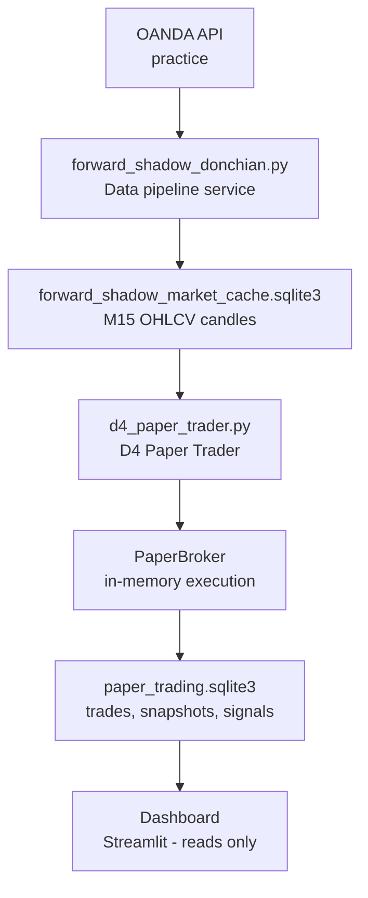
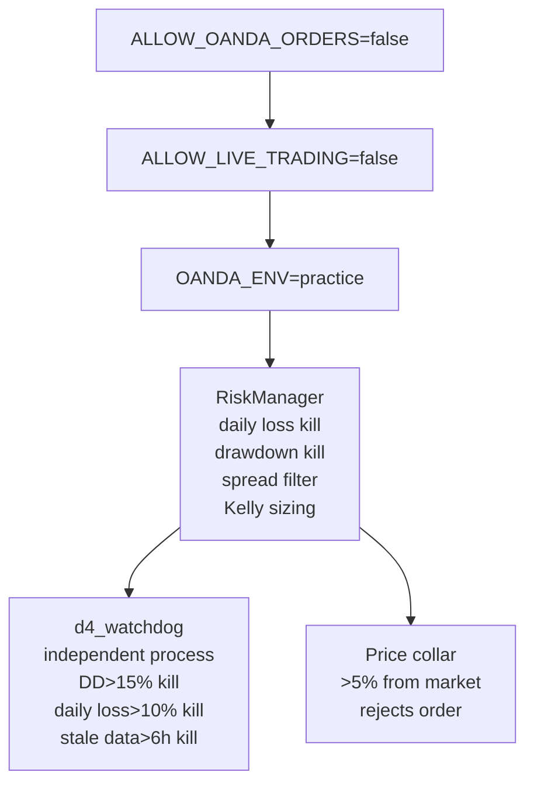

# AURUM-1

[](https://github.com/Naxisbeast/AURUM-1/actions/workflows/test.yml)
[](https://www.python.org/)
[]()

AURUM-1 is an autonomous quantitative research and paper-trading system for **XAU/USD (gold)**. It is designed to honestly validate a trading strategy before any real-money consideration: a candidate must survive an 11-year backtest, walk-forward validation, transaction-cost stress tests, Monte Carlo simulation, and a live paper-trading record before it is taken seriously.

The system currently runs **D4** — a Donchian 20-bar breakout with a fixed 2R exit, trading both directions with no filters — as a fully autonomous paper trader. It has been paper trading since 2026-06-28 at 0.35% risk per trade.

The strategies are temporary. The validation pipeline is the product.

---

## The Problem

Most retail/systematic trading "strategies" are validated on a handful of recent trades, on backtests with lookahead bias, or on in-sample curves that look great and fail live. The failure modes are well known:

- Lookahead / same-bar leakage inflates backtest results.
- Selection bias — picking the best of many tested variants — overstates the edge.
- Transaction costs (spread + slippage) are ignored or modeled optimistically.
- A few lucky trades get mistaken for an edge.

AURUM-1 is an attempt to build a process that avoids those traps *by construction* rather than by intention:

- **Causality is verified in code** — feature engineering and the backtest engine assert no lookahead (`aurum1/features/engineer.py::assert_no_lookahead`, `settings.yaml → backtesting.verify_feature_causality: true`).
- **Selection bias is corrected** — a trial ledger records every variant tested, and a Deflated Sharpe Ratio (`aurum1/research/deflated_sharpe.py`, Bailey & López de Prado 2014) discounts the observed Sharpe by the number of trials.
- **Costs are modeled pessimistically** — PaperBroker applies session-aware spread and folded-normal (asymmetric) slippage; no favorable slippage on market orders.
- **Decision gates are pre-registered** — the 50-trade and 100-trade review criteria were written *before* the trades accumulated, so the goalposts cannot move.
- **No live capital** — OANDA orders are hard-blocked by environment interlocks. The system fails closed.

---

## Architecture

AURUM-1 is layered data → features → signal → risk → execution → backtesting → monitoring. Data collection is decoupled from trading: the forward-shadow service maintains a local market cache, and the paper trader reads from that cache (no broker API key needed past the data pipeline).



**Layer stack** (top to bottom):

| Layer | Module | Responsibility |
|---|---|---|
| Execution | `aurum1/execution/engine.py`, `aurum1/execution/broker.py` | Route approved orders to `PaperBroker` (or `OandaBroker`); handle SL/TP, spread, slippage |
| Risk | `aurum1/risk/manager.py` | Kelly-capped position sizing, kill switches, spread filter |
| Signal | `scripts/paper_trading/d4_paper_trader.py` | Donchian 20 breakout (close vs 20-bar high/low, `shift(1)` — no same-bar lookahead) |
| Feature | `scripts/research/research_edge_prototypes.py` | ATR, Donchian levels, EMAs, session flags (used by trader + shadows) |
| Data | `aurum1/data/ingestion.py` | `load_ohlcv`, `load_settings`, `AurumDataIngestor` (OANDA/FRED/COT/calendar/news with retry + fallback) |

### 60-second poll cycle

Every 60 seconds, the D4 paper trader:

1. Reads new M15 candles from the market cache
2. Computes features (ATR, Donchian levels)
3. Checks for a Donchian 20 breakout (close > 20-bar high → BUY, < 20-bar low → SELL)
4. If breakout: evaluates via `RiskManager` (Kelly sizing, kill switches)
5. If approved: submits order to `PaperBroker`
6. `PaperBroker.update_prices` checks SL/TP on all open positions every cycle
7. Persists state: trades, account snapshots, open positions, missed signals, health file

### Services

| Service | Function | Type |
|---|---|---|
| `aurum1-forward-shadow.service` | Market data pipeline (OANDA → cache) | Continuous |
| `aurum1-d4-paper.service` | D4 autonomous paper trader | Continuous |
| `aurum1-dashboard.service` | Streamlit dashboard (read-only) | Continuous |
| `aurum1-watchdog.service` | Independent kill-switch monitor | Continuous |
| `aurum1-d4-shadow.timer` | D4 shadow analysis | Every 15 min |

---

## Paper-Trading Safety Model

The system layers several independent safeguards that the trading algorithm cannot disable:



- **Environment interlocks** — `ALLOW_OANDA_ORDERS=false`, `ALLOW_LIVE_TRADING=false`, `OANDA_ENV=practice`. The forward shadow asserts these at startup and fails closed.
- **In-process kill switches** — `RiskManager` stops trading on a 3% daily loss or 8% drawdown from 30-day peak equity; a 5% drawdown threshold triggers half-sized positions.
- **Independent watchdog** — `monitor/d4_watchdog.py` runs as a separate process (so it survives a trader crash) and polls the health file every 5s. Thresholds are hardcoded and cannot be changed by settings or env: 15% max drawdown, 10% max daily loss, 5% equity drop in 1h, stale data > 6h → force restart.
- **Price collar** — orders more than 5% from the current market price are rejected, guarding against corrupted data feeds.
- **State persistence** — trades, snapshots, open positions, and missed signals survive restart via SQLite; a PID file prevents duplicate instances.

---

## Backtesting and Validation

The backtest suite (`aurum1/backtesting/`) is event-driven: it iterates bar-by-bar, fills at next-bar open, and verifies feature causality. Validation results for D4 over 11 years of XAU/USD M15 data:

| Validation | Result |
|---|---|
| Walk-forward (18 windows) | 88.9% positive windows, mean PF 1.14, mean Sharpe 1.27 |
| Monte Carlo (10,000 simulations) | 0% ruin probability |
| Transaction-cost stress (6p spread + 2p slippage) | Still profitable (PF 1.09) |
| Signal stationarity (ADF test) | Stationary — not trading noise |

The three primary validation tools:

- **Walk-forward** (`aurum1/backtesting/walk_forward.py`) — trains on a rolling window, tests out-of-sample on the next non-overlapping window, and reports a 6-criteria promotion gate (Sharpe, PF, win rate, drawdown, positive-window rate).
- **Monte Carlo** (`aurum1/backtesting/monte_carlo.py`) — resamples the observed R-multiple distribution, with a regime-aware block bootstrap that preserves serial correlation.
- **Deflated Sharpe Ratio** (`aurum1/research/deflated_sharpe.py`) — corrects the observed Sharpe for the number of trials and non-normality, using the trial ledger (`aurum1/research/trial_ledger.py`) that records every variant tested.

**Pre-registered gates** (from `docs/STATUS.md`): the 50-trade risk-review gate passed 4/4 criteria (2026-08-05); the 100-trade strategy-review gate ran at 104 trades (2026-08-16) with 2/3 automated criteria passing. The DSR criterion failed only because the trial pool is thin (4 same-family trials); the pre-registered response is to extend to 200 trades before any capital consideration.

**Live paper record (as of 2026-08-28, per `docs/STATUS.md`)** — the authoritative DB lives on the server; these are the last documented figures:

| Metric | Value |
|---|---|
| Closed trades | 136 |
| Win rate | 50.0% |
| Net PnL | +$1,161 |
| Avg R | +0.49R |
| Equity | $11,316 (+13.2% from $10,000 start) |
| Lifetime max drawdown | ~2.5% (vs 15% gate threshold) |

---

## Testing / CI

`.github/workflows/test.yml` runs on every push/PR to `main` (Python 3.12, Ubuntu). It runs **245 tests across 13 files** — no network, no DB, no API keys required:

| Area | Tests |
|---|---|
| Core unit (PaperBroker, RiskManager, Donchian signals, instruments) | 78 |
| D4 regression + backtest sanity | 9 |
| Trade quality scoring (MAE/MFE) | 18 |
| Prop-firm challenge simulator | 20 |
| Evidence / decision gates | 12 |
| Research edge prototypes | 2 |
| Execution engine + OandaBroker (mocked) | 37 |
| Dashboard metrics | 27 |
| Forward-shadow pipeline (CI-safe) | 42 |
| **Total** | **245** |

The test suite is deliberately runnable with no market data or credentials — the forward-shadow CI tests generate data in-memory, and the execution tests mock the broker.

---

## Deployment Model

AURUM-1 is **not containerized** — this is a deliberate decision recorded in `docs/system/CONTAINERIZATION_DECISION.md`. It is designed to run as **systemd services on a Linux box** (verified on Ubuntu 24.04 / Hetzner VM):

- Python 3.12 virtualenv at `/opt/aurum1/.venv`
- Service unit templates in `deploy/` (D4 paper trader, forward shadow, dashboard, watchdog, shadow timer)
- `deploy/logrotate/aurum1` — daily log rotation (14 rotated, compressed)
- State in local SQLite files (backed up daily via `forward-shadow-backup.timer`)

Deployment is manual per `docs/DEPLOYMENT.md`: create the `aurum1` system user, clone to `/opt/aurum1`, create the venv, copy `.env.example` → `.env`, copy unit files to `/etc/systemd/system/`, and `systemctl enable --now` each service. There is no Dockerfile or provisioning script.

---

## Quick Start

```bash
git clone git@github.com:Naxisbeast/AURUM-1.git
cd AURUM-1
python3.12 -m venv .venv
source .venv/bin/activate        # Windows: .venv\Scripts\activate
pip install -r requirements.txt

# Run the CI test suite (245 tests)
python -m pytest tests/test_paper_broker.py tests/test_risk_manager.py \
  tests/test_donchian_signals.py tests/test_instruments.py \
  tests/test_d4_regression.py tests/test_backtest_sanity.py \
  tests/test_trade_quality.py tests/test_prop_firm_simulator.py \
  tests/test_evidence.py tests/test_research_edge_prototypes.py \
  tests/test_phase6_execution.py tests/test_metrics.py \
  tests/test_forward_shadow_ci.py -q --basetemp .pytest_tmp -p no:cacheprovider

# Run the D4 paper trader once (reads the local market cache; no OANDA key needed)
python -m scripts.paper_trading.d4_paper_trader --run-once

# Run the forward shadow once (needs a populated market cache)
python -m scripts.shadow.forward_shadow_donchian run-once
```

### Data requirements

The paper trader reads from `aurum1/data/forward_shadow_market_cache.sqlite3`, which the forward-shadow service maintains from the OANDA API. **The SQLite caches are gitignored** — a fresh clone has no market data. To get real data:

1. Set `OANDA_API_KEY` / `OANDA_ACCOUNT_ID` in `.env` (practice environment).
2. Run the forward shadow as a service (`python -m scripts.shadow.forward_shadow_donchian service --start-date <UTC-ISO>`) to populate the cache.

The backtest (`scripts/backtesting/run_backtest.py`) requires ≥ 20,000 M15 bars / 250 days of history in `backtest_market_cache.sqlite3`, or the `--allow-gold-futures-proxy` flag to fall back to yfinance `GC=F`. Without market data or a key, the backtest fails closed with a clear message; the CI test suite is the only fully offline path.

---

## Repository Structure

```
aurum1/       Core library (data, features, signals, risk, execution, backtesting, research)
scripts/      Executables (paper trader, shadows, backtests, research, gates, dashboard launcher)
monitor/      Dashboard, metrics, watchdog, trade quality, prop-firm sim, evidence
deploy/       Systemd service unit templates + logrotate config
docs/         Documentation (architecture, data flow, deployment, status, strategies)
tests/        245-test CI suite
research/     Strategy variant research — promoted / completed / rejected
```

---

## Things That Didn't Work

AURUM-1 archives its failures as deliberately as its successes. The most instructive:

- **ML ensembles added no edge.** D6 (Donchian + ML ensemble filter) is statistically identical to D4 (PF 1.14, +$42,681 vs D4's +$42,678 over 11 years). The models rarely disagreed with the raw signal.
- **Market regime classifiers** were built, trained, and archived — they did not improve outcomes.
- **Multi-stage state-machine entries** (the original orchestrator) were replaced by a simpler direct path and stopped 2026-05-27.
- **Over-filtered breakouts** — volatility and session filters looked good over 12 months (D2 PF 1.33) but failed over full cycles (D2 PF 1.03 over 11 years); filters removed good trades alongside bad ones.
- **Adaptive ATR stops + volume-imbalance filters** (D5) removed 83% of trades and underperformed the simple fixed 2R exit.
- **An over-optimistic slippage model** overstated returns and was replaced with folded-normal (asymmetric) slippage — an audit fix.
- **Broken persistence layers** that could have lost trade history were caught and fixed.

Every failed experiment is documented in `research/rejected/` and the commit history, because knowing why something doesn't work is often more valuable than knowing why it does.

---

## Limitations

- **Paper trading only — no live capital.** OANDA orders are hard-blocked by environment interlocks.
- **Single instrument** (XAU/USD), **M15 timeframe focus**.
- **Market-data dependency** — SQLite caches are gitignored; a fresh clone has no market data, and the backtest fails closed without it.
- **Small live sample** — 136 closed trades is still modest; the DSR gate is underpowered until ~200 trades accumulate. Historical/paper performance is **not indicative of future results**.
- **Not a turnkey deploy** — systemd + single VM + SQLite by explicit decision; no Dockerfile or provisioning script.

---

## Documentation

| Document | Contents |
|----------|----------|
| [ARCHITECTURE.md](docs/ARCHITECTURE.md) | System design, layer stack, safety architecture, DB schema |
| [DATA_FLOW.md](docs/DATA_FLOW.md) | End-to-end pipeline and 60-second poll cycle |
| [DEPLOYMENT.md](docs/DEPLOYMENT.md) | systemd deployment, service reference, operations, safety checklist |
| [STATUS.md](docs/STATUS.md) | Current operational state, gate results, maintenance log |
| [STRATEGIES.md](docs/STRATEGIES.md) | Donchian variant family D1–D7, ranked by 11-year performance |
| [TRUTH_MAP.md](docs/system/TRUTH_MAP.md) | Forensic map of the system: production vs research vs legacy code |
| [AUDIT_ROADMAP.md](docs/system/AUDIT_ROADMAP.md) | Audit improvement roadmap and decision records |
