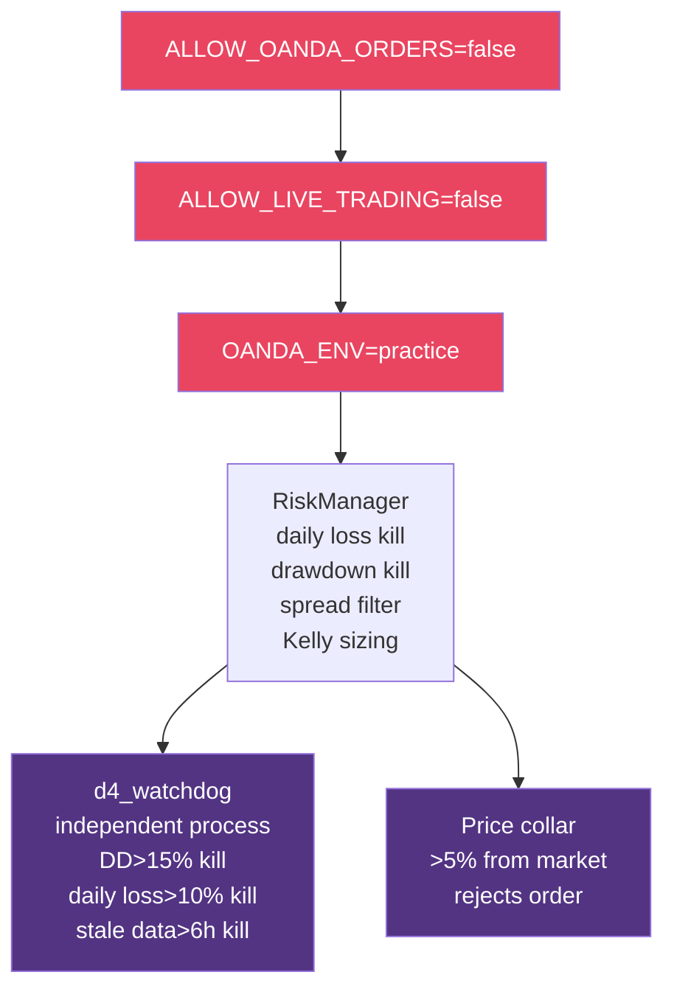

# AURUM-1 System Architecture

**Note**: This document describes the current live system (D4 Paper Trader).
The original ML orchestrator architecture has been archived — see `archive/aurum1/orchestrator.py` for reference.

---

## Data Flow

```
OANDA API (practice)
    ↓
forward_shadow_donchian.py (continuous service — polls every 60s)
    ↓
forward_shadow_market_cache.sqlite3 (M15 OHLCV candles)
    ↓
d4_paper_trader.py (continuous service — polls every 60s)
    ↓
PaperBroker (in-memory simulated execution)
    ↓
paper_trading.sqlite3 (trades, snapshots, missed signals)
    ↓
Streamlit Dashboard (reads only, served via nginx → Cloudflare Tunnel)
```

---

## 60-Second Poll Cycle

Every 60 seconds, the D4 Paper Trader:

1. Reads new candles from the market cache
2. Computes features (ATR, Donchian levels)
3. Checks for Donchian 20 breakout (close > 20-bar high or < 20-bar low)
4. If breakout: evaluates via RiskManager (Kelly sizing, kill switches)
5. If approved: submits order to PaperBroker
6. PaperBroker checks SL/TP on all open positions every cycle
7. Persists state: trades, account snapshots, health file

---

## Layer Architecture

```
┌─────────────────────────────────────────────┐
│ Execution Layer                              │
│  ExecutionEngine → PaperBroker / OandaBroker │
├─────────────────────────────────────────────┤
│ Risk Layer                                   │
│  RiskManager (Kelly sizing, kill switches)    │
├─────────────────────────────────────────────┤
│ Signal Layer                                 │
│  Donchian 20 breakout (no state machine)      │
├─────────────────────────────────────────────┤
│ Feature Layer                                │
│  research_edge_prototypes (ATR, Donchian)     │
├─────────────────────────────────────────────┤
│ Data Layer                                   │
│  load_ohlcv, load_settings (SQLite)           │
└─────────────────────────────────────────────┘
```

---

## Safety Architecture



---

## Services (Server)

| Service | Function | Type |
|---------|----------|------|
| `aurum1-d4-paper.service` | D4 Paper Trader | Continuous |
| `aurum1-forward-shadow.service` | Market data pipeline | Continuous |
| `aurum1-dashboard.service` | Streamlit dashboard | Continuous |
| `aurum1-watchdog.service` | Independent kill switch monitor | Continuous |
| `aurum1-tunnel.service` | Cloudflare tunnel | Continuous |
| `aurum1-d4-shadow.timer` | D4 shadow analysis | Every 15 min |

---

## Database Schema

**`paper_trading.sqlite3`**:
- `trades` — Completed trades with entry/exit times, prices, R-multiple, fees
- `account_snapshots` — Equity, balance, peak equity (every ~15 min)
- `open_positions` — Current open positions (survives restart)
- `missed_signals` — Rejected signals with reason
- `settings` — Key-value store (last_processed_ts)

**`forward_shadow_market_cache.sqlite3`**:
- `ohlcv_M15` — M15 candles from OANDA (~236K rows)
- Additional tables for macro, COT, news (populated but unused by D4)
