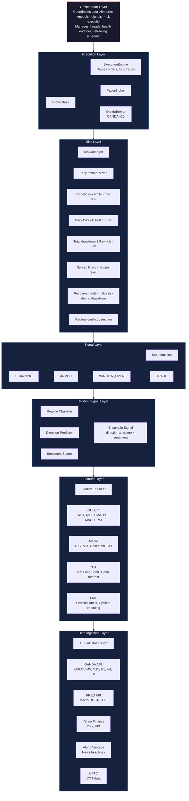
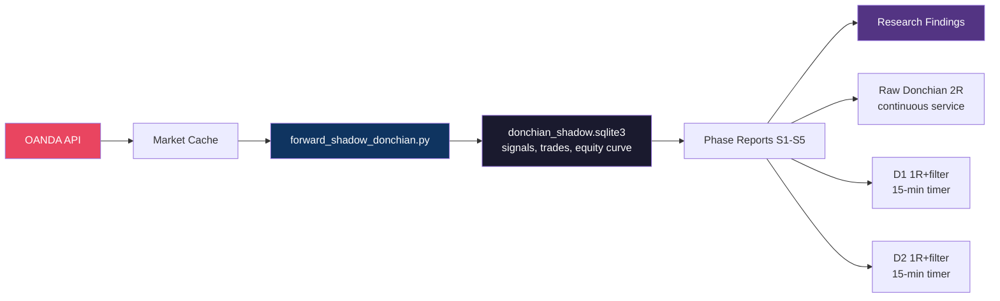
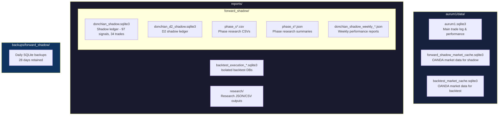
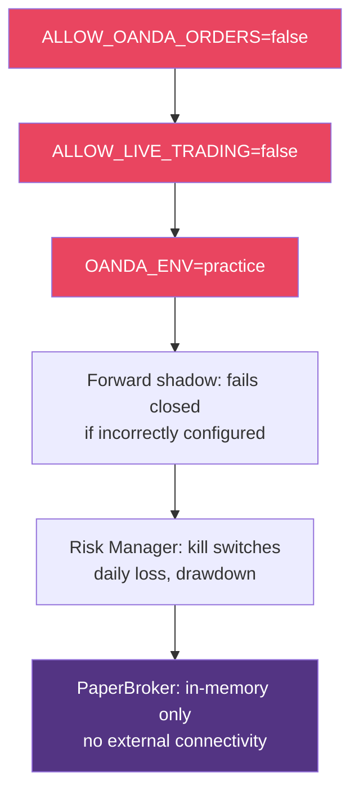

# AURUM-1 System Architecture

## Overview

AURUM-1 follows a layered architecture with strict dependency rules:
each layer only calls the layer below it.

### Layered Architecture

---

## Research Layer (Parallel System)

The research system is independent of the main trading pipeline:

---

## Storage Architecture

---

## Safety Architecture

---

## Threading Model

The orchestrator runs on the main thread with three background threads:

| Thread | Purpose | Interval |
|--------|---------|----------|
| Main | M15 candle processing loop | Every 15 min (aligned to candle close) |
| macro-refresh | Fetch macro data | Every 60 min |
| sentiment-refresh | Fetch news | Every 30 min |
| retraining | Check if weekly retraining due | Every 60 sec |
| health | Flask HTTP health endpoint | Continuous |

> **Note**: The orchestrator and ML models depicted above are legacy (stopped since May 27, 2026).
> The current live system is the D4 Paper Trader which uses a simplified direct path:
> market cache -> features -> Donchian signal -> RiskManager -> PaperBroker.
> See [TRUTH_MAP.md](system/TRUTH_MAP.md) for the actual runtime architecture.
