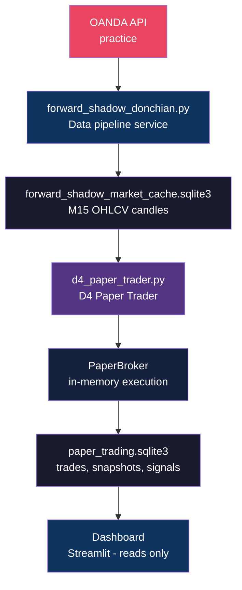
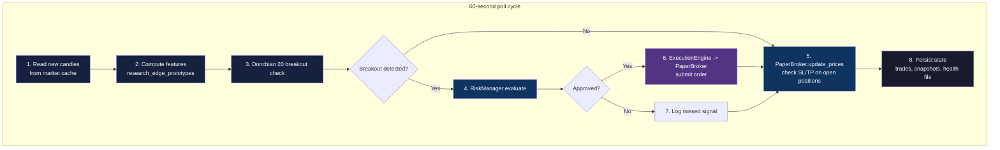
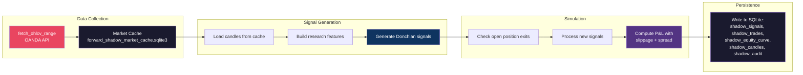

# AURUM-1 Data Flow

## End-to-End Pipeline (Current Live System)



---

## D4 Paper Trader Cycle

Every 60 seconds:



---

## Forward Shadow Pipeline (Data Collection)

Every 60 seconds:



---

## D1/D2 Shadow Pipeline

Every 15 minutes (timer-based):

```mermaid
flowchart TD
    subgraph D1[D1 - Filtered Donchian 1R]
        A1[Read shadow signals<br/>from donchian_shadow.sqlite3] --> B1[Apply D1 filter:<br/>HOLD if vol==high<br/>HOLD if session==London<br/>TAKE otherwise]
        B1 --> C1[Simulate fixed 1R exit<br/>from candle data]
        C1 --> D1[Write to<br/>phase_s5_d1_shadow_journal.csv]
    end

    subgraph D2[D2 - Standalone Donchian 1R]
        A2[Read M15 candles<br/>from market cache] --> B2[Generate Donchian signals]
        B2 --> C2[Apply vol/session filter]
        C2 --> D2[Simulate 1R exit<br/>with full P&L]
        D2 --> E2[Print JSON summary<br/>to journalctl]
    end

    style D1 fill:#16213e,color:#fff
    style D2 fill:#16213e,color:#fff
    style D1 fill:#0f3460,color:#fff
    style E2 fill:#533483,color:#fff
```

---

## Main Pipeline (Legacy Orchestrator)

> **Note**: This pipeline is stopped since May 27, 2026. The D4 Paper Trader
> replaced it with a simplified direct path.

```mermaid
flowchart LR
    A[fetch_ohlcv M15 count=3<br/>OANDA API] --> B[Append to OHLCV buffer<br/>in-memory DataFrame]
    B --> C[Build features<br/>FeatureEngineer]
    C --> D[Predict regime<br/>RegimeClassifier]
    D --> E[Predict direction<br/>DirectionPredictor]
    E --> F[Score sentiment<br/>SentimentScorer]
    F --> G[Ensemble signals<br/>EnsembleSignal.combine]
    G --> H[State machine<br/>StateMachine.on_candle]
    H --> I{Instruction emitted?}
    I -->|Yes| J[Evaluate risk<br/>RiskManager.evaluate]
    J --> K[Execute order<br/>ExecutionEngine.execute]
    K --> L[Log trade<br/>trades_log table]
    I -->|No| M[Log equity snapshot<br/>performance_log table]
    L --> M


---

## Data Files Reference

| File | Type | Contents |
|------|------|----------|
| `aurum1/data/aurum1.sqlite3` | SQLite | Trade history, performance log (gitignored) |
| `aurum1/data/forward_shadow_market_cache.sqlite3` | SQLite | M15, H1, H4, macro data for shadow |
| `aurum1/data/backtest_market_cache.sqlite3` | SQLite | M15, H1, H4, macro data for backtest |
| `reports/forward_shadow/donchian_shadow.sqlite3` | SQLite | Shadow signals, trades, equity curve |
| `reports/forward_shadow/phase_s5_d1_shadow_journal.csv` | CSV | D1 filtered journal entries |
| `reports/forward_shadow/donchian_shadow_weekly_*.json` | JSON | Weekly performance reports |
| `reports/backtest_execution_*.sqlite3` | SQLite | Isolated backtest results |
| `backups/forward_shadow/donchian_shadow_*.sqlite3` | SQLite | Daily database backups |
